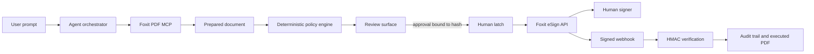
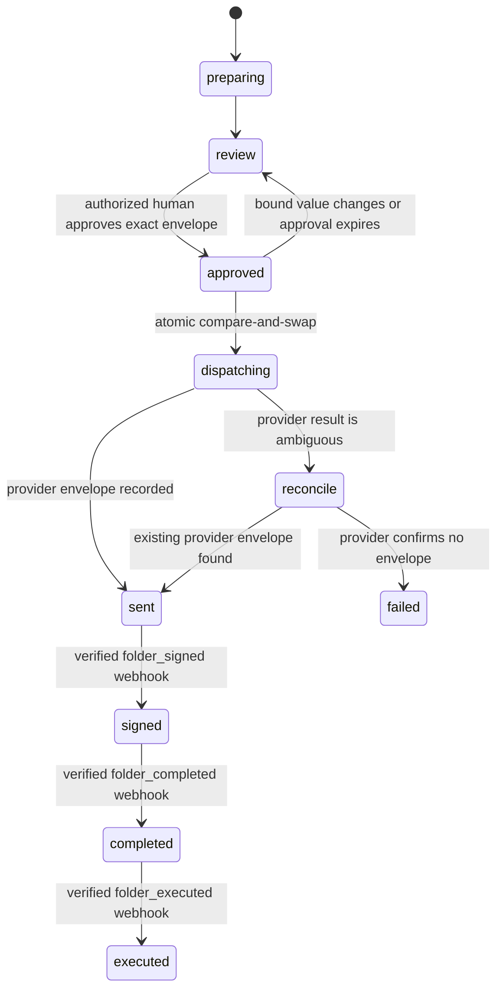

# Architecture and trust boundaries

## Challenge constraint

Foxit does not prescribe a framework, cloud provider or diagram format. It does prescribe an architectural boundary:

- Foxit's open-source MCP server handles reversible PDF work.
- Signing is intentionally not included in that MCP catalog.
- The application calls Foxit eSign directly with server-side credentials.
- A person must sign the document.
- The submission should make the handoff defensible and visible.

## Proposed system



## Authority model

The agent may prepare documents, propose recipients and fields, run deterministic checks, and explain findings. It may not approve its own output, change recipients after approval, send a different artifact, invoke eSign without a valid unconsumed approval, or present an LLM risk score as legal advice.

## Approval invariant

```text
SHA-256("signlatch:approval:v1\n" + canonical-json(approval envelope))
```

The versioned envelope binds the tenant, workflow, immutable document byte hash,
ordered recipients, signer fields, delivery options, policy ruleset hash,
approval identity, approver identity, expiry and Foxit account. The canonical
encoding is implemented in `src/core/approval/envelope.ts` and locked by golden
vectors.

Any bound change invalidates the approval and returns the workflow to review.
The eSign dispatch store atomically consumes the approval exactly once.
An ambiguous provider timeout enters reconciliation and must never cause a new
send with a new idempotency key.

## State model



Only `executed` is terminal proof that Foxit finalized the digital signatures and
made the executed artifact eligible for retrieval. The application must fail closed
for transitions not shown here. The dispatcher
uses a durable outbox and a stable provider idempotency key derived from the
approval digest. The in-memory harness demonstrates semantics; PostgreSQL integration
tests prove durable invalidation, consumption, and concurrent enqueue behavior.

Outbox workers acquire rows with `FOR UPDATE SKIP LOCKED`. A failure may return
to `pending` only when the adapter can prove that no provider request was sent.
Thrown errors, exhausted retry budgets and ambiguous responses transition the
workflow to `reconcile`. They never trigger a blind resend.

Every worker completion is fenced by the outbox ID, worker ID and a monotonically
increasing lease generation. Expired leases move to `reconcile`; a late worker
cannot complete after recovery, even if the same worker ID acquires a later
generation.

## Planned components

- Next.js App Router web application.
- Node.js route handlers for server-only integrations.
- Foxit PDF API MCP client for reversible operations.
- Deterministic policy engine with versioned findings.
- Persistence for document state, approval and webhook idempotency.
- Foxit eSign adapter isolated from the agent tool registry.
- HMAC-verified webhook endpoint.
- Event timeline for final demo and audit evidence.

The M3 client uses the official Python Foxit MCP server over stdio. Its tool
registry is reduced to upload, text-to-PDF conversion and download; untrusted
document text never controls tool selection or filesystem paths. See
[Foxit MCP developer setup](foxit-mcp-setup.md) and
[ADR 0003](decisions/0003-foxit-mcp-stdio-boundary.md).

## Required runtime evidence

- Prompt-to-document flow using real Foxit MCP operations.
- Blocked signing before human approval.
- Visible document hash, recipients and findings at approval time.
- Successful direct eSign handoff after approval.
- Verified completion webhook, executed PDF and activity history.
- Negative tests for changed artifacts, changed recipients, replayed approvals and invalid webhook signatures.

## Architecture gates

The dispatcher cannot be enabled until the approval contract, state transition
contract, authentication boundary, immutable artifact store and durable
idempotency design have tests. Webhook processing additionally requires raw-body
signature fixtures and replay tests. See [roadmap.md](roadmap.md).

## Status as of 2026-08-26

The exact approval v2 contract, durable review versions, one-way approval,
invalidation, atomic dispatch enqueue, stable provider key, raw-body webhook verifier,
monotonic event store, authorized timeline, and executed-document verifier are
implemented and fixture-tested. Foxit eSign remains disabled by default. No provider
delivery or completed-signature claim is live-demonstrated until the separately
authorized sandbox journey records a provider envelope, authenticated events, and the
independently hashed executed PDF.
